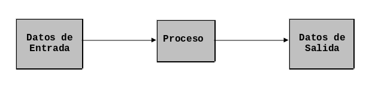

# Conceptos Básicos y Metodología

La computadora no es sólo una máquina que realiza procesos para devolver 
resultados sin que se tenga la noción exacta de las operaciones que realiza. Con
la computadora también es posible diseñar **soluciones a la medida** para
problemas específicos. Es mucho más útil, si estos problemas involucran operaciones
matemáticas complejas o repetitivas, o requieren del manejo de un volumen muy
grande de datos.

El diseño de soluciones a la medida de problemas específicos requiere una
**metodología** que enseñe de forma gradual, la forma de llegar a dichas
soluciones.

A las soluciones creadas por computadora se les conoce como **programas** y no
son más que una serie de operaciones que realiza la computadora usando un
grupo específico de datos para llegar a un resultado. Por lo tanto, un programa
sirve para **solucionar** un problema específico.

Para crear programas, también se deben conocer las funciones que puede realizar
una computadora y las formas en que se pueden manejar los elementos que la
componen.

## Introducción

Antes de continuar, se debe comprender que una computadora **no tiene
inteligencia por sí sola**. La computadora no puede realizar tarea alguna que no
haya sido previamente determinada por una persona. Para comenzar, se explican
dos conceptos fundamentales para comprender cómo crear programas.

Programa

:   Es el conjunto de instrucciones escritas en algún lenguaje de programación y
    que ejecutadas secuencialmente por una computadora resuelven un problema
    específico.

Computadora

:   Es un dispositivo electrónico utilizado para procesar información y obtener
    resultados. Los datos se pueden introducir en la computadora como entradas
    (**input**) para después ser procesadas y producir una salida (**output**).
    La siguiente figura ilustra lo anterior:
    
    

A continuación se describen en detalle los elementos que conforman una
computadora personal:

Dispositivos de Entrada

:   Los dispositivos de entrada sirven para ingresar datos en la computadora
    para su proceso. Los datos se **leen** de los dispositivos de entrada y se
    almacenan en memoria. Algunos ejemplos de dispositivos de entrada son: el
    teclado, el **scanner**, el **mouse**, el **joystick**, y el lápiz óptico.

Dispositivos de Salida

:   Los dispositivos de salida regresan los datos procesados que sirven
    de información al usuario. Por ejemplo: el monitor y la impresora.

La Unidad Central de Procesamiento

:   Se le conoce popularmente como CPU (**Central Process Unit**), es el
    componente de la computadora que interpreta las instrucciones y procesa los
    datos que se le proporcionan y se divide en dos partes:

    * **Unidad de Control**  La Unidad de Control coordina las actividades de la
      computadora y determina que operaciones se deben realizar y en que orden;
      es decir, controla todos los procesos que realiza la computadora.
    * **Unidad Aritmético-Lógica** Esta unidad realiza operaciones aritméticas y
      lógicas, tales como suma, resta, multiplicación, división y comparaciones.

Memoria

:   La memoria de la computadora se clasifica en dos tipos:

    * **Memoria Central (interna o principal)** La CPU utiliza la memoria de la
      computadora para guardar información mientras trabajas con ella; en tanto
      la información permanezca en memoria, la computadora puede tener acceso en
      forma directa.
    * **Memoria Auxiliar (Externa)** En esta memoria se almacenan todos los
      programas o datos que el usuario desee. Los dispositivos de almacenamiento
      o memorias auxiliares (externas o secundarias) más utilizados son:
      los discos duros, los CD-ROM, DVD-ROM y las memorias USB.

## Definición de Lenguaje

Lenguaje

:   Un lenguaje es una serie de símbolos que sirven para transmitir uno o más
    mensajes (ideas) entre dos entidades diferentes. A la transmisión de
    mensajes se le conoce como **comunicación**.

Comunicación

:   La comunicación es un proceso complejo que requiere una serie de
    reglas simples para llevarse a cabo. Las tres principales son las siguientes:

    -   Deben existir forzosamente 5 elementos: un emisor, un receptor,
        un medio de comunicación, un mensaje, y un lenguaje que puedan
        entender tanto el emisor como el receptor

    -   Los mensajes deben correr en un sentido a la vez.

    -   Los mensajes que intercambien el emisor y el receptor deben
        estar en un lenguaje que ambos puedan interpretar.

Lenguaje de programación

:   Un lenguaje de programación es un conjunto de símbolos, caracteres y reglas
    que le permiten a las personas comunicarse con la computadora. Los lenguajes
    de programación tienen un conjunto de instrucciones que nos permiten
    realizar operaciones de **entrada/salida**, **cálculo**,
    **manipulación de texto**, **lógica/comparación** y
    **almacenamiento/recuperación**.

Los lenguajes de programación se clasifican en:

-   **Lenguaje de Máquina**. Es un lenguaje cuyas instrucciones son directamente
    entendibles por la computadora y no necesitan traducción posterior para que
    la CPU pueda comprender y ejecutar el programa. Las instrucciones en
    lenguaje de maquina se expresan en términos de la unidad de memoria más
    pequeña el bit (0 o 1).

-   **Lenguaje de Bajo Nivel o Ensamblador**. En este lenguaje de programación
    las instrucciones se escriben en códigos alfabéticos conocidos como
    mnemotécnicos y se usan direcciones de memoria simbólicas. La mnemotecnia
    asigna un código a cada comando de la máquina.

-   **Lenguaje de Alto Nivel**. Los lenguajes de programación de alto nivel
    (Java, C\#, Scala, Ruby, PHP, JavaScript, etc.) son aquellos en los que las
    instrucciones o sentencias de la computadora están escritas con palabras
    similares a los lenguajes humanos (inglés), lo que facilita la escritura y
    comprensión del programa.

## Definición de Algoritmo

La palabra "algoritmo" deriva del nombre latinizado del matemático árabe Mohamed
Ibn Moussa Al Kow Rizmi, el cual escribió entre los años 800 y 825 su obra:
"Quitab Al Jabr Al Mugabala", donde se recogía el sistema de numeración hindú y
el concepto del cero. Fue Fibonacci, el que tradujo su obra al latín y la inició
con las palabras: **Algoritmi dicit**.

Un algoritmo es una serie de pasos organizados que describe el proceso que se
debe seguir para dar solución a un problema específico. Los algoritmos se
clasifican en:

-   **Algoritmos cualitativos**. Son aquellos en los que se describen los pasos
    utilizando palabras.

-   **Algoritmos cuantitativos**. Son aquellos en los que se utilizan cálculos
    numéricos para definir los pasos del proceso.

Supon, por ejemplo, que deseas escribir un algoritmo para sumar dos números. Si
se utiliza un algoritmo cualitativo, usando sólo palabras, los pasos son como
los siguientes:

1.  Preguntar cuales son esos dos números.
2.  Sumar los dos números obtenidos en el paso 1.
3.  Comunicar el resultado.

Por otro lado, si usáramos un algoritmo cualitativo tendríamos que usar
fórmulas como las siguientes:

1.  Sean `A` y `B` dos variables con los valores que queremos sumar.
2.  Sea `C = A + B`.
3.  El resultado de la suma es `C`.

## Lenguajes Algorítmicos

Un lenguaje algorítmico es una serie de símbolos y reglas que se utilizan para
describir de manera explícita un proceso. Los lenguajes algorítmicos se
clasifican en dos tipos:

-   **Lenguajes gráficos**. Este tipo de lenguajes representan gráficamente las
    operaciones que realiza un algoritmo (diagrama de flujo).

-   **Lenguajes no gráficos**. Estos lenguajes expresan en forma descriptiva las
    operaciones que debe realizar un algoritmo (pseudocódigo).

Ambos lenguajes se analizan a detalle en el Capítulo
[3](docs/lenguajes-algorítmicos.html).

## Metodología para la Solución de Problemas por Computadora

Una metodología define una manera sistemática de hacer algo. En esta Sección se
explica la metodología que establece qué es lo que se debe hacer al crear
programas de computadora.

### Definición del Problema

Resolver un problema consiste en comprender de qué trata y **especificarlo** lo
más formalmente posible con el propósito de eliminar la **ambigüedad**, la
**inconsistencia** y la **incompletitud**, con miras a obtener un enunciado
**claro**, **preciso**, **conciso** y que capture todos los requerimientos.

La especificación de un problema en lenguaje natural lleva consigo problemas de
inconsistencia, ambigüedad e incompletitud, razón por la cual es necesario
utilizar lenguajes más formales como las matemáticas (lógica, teoría de
conjuntos, álgebra, etc.) para evitar estos problemas.

-   **Ejemplo de ambigüedad**. La frase "Mira al hombre en el patio con un
    telescopio" se presta a ambigüedad. ¿Utilizamos un telescopio para mirar al
    hombre en el patio o el hombre que miramos tiene un telescopio?

-   **Ejemplo de inconsistencia**. En ocasiones, el enunciado que describe el
    problema que se quiere resolver puede incurrir en contradicciones. Piense
    por ejemplo en las reglas de comportamiento de un procesador de palabras:

    -   Todas las líneas de texto tienen la misma longitud, indicada por el
        usuario.
    -   Un cambio de línea debe ocurrir solo después de una palabra, a menos que
        el usuario pida explícitamente la división por sílabas.

    La inconsistencia resulta al preguntarse ¿Qué pasa cuando la palabra es más
    larga que la línea? Si el usuario no pide explícitamente la división por
    sílabas, esta línea tendrá mayor longitud.

-   **Ejemplo de incompletitud** Por incompletitud se entiende que en el
    enunciado no todos los términos están bien definidos o que no están
    capturados todos los requerimientos del problema. En un manual de un
    procesador de palabras se encuentra la frase "Seleccionar es el proceso de
    designar las áreas de su documento sobre las cuales desea trabajar" ¿qué
    significa designar? ¿Qué significa área? ¿Cómo deben ser las áreas? ¿Es una
    sola área?

En otras palabras, la definición del problema consiste en encontrar una
representación del problema donde todo esté dicho, ya sea mediante gráficos, o
utilizando otro lenguaje distinto al natural (por ejemplo las matemáticas). Esta
etapa permite simplificar el problema, buscando modelos abstractos equivalentes
y eliminando información superflua.

Un problema no estará del todo comprendido si no se ha encontrado una
representación en la cual todos los elementos que intervienen sean representados
sin redundancia, sin ambigüedad y sin inconsistencias. El universo de búsqueda
de la solución estará en ese momento bien delimitado y surgirá en forma más
clara la dificultad principal del problema. El problema se vuelve más abstracto
y más puro. Se habla entonces de un **enunciado cerrado**.

### Análisis del Problema

Una vez que se ha comprendido lo que se desea que la computadora haga, es
necesario definir:

-   Los datos de entrada.
-   Cuál es la información que se desea producir (salida).
-   Los métodos y fórmulas que se necesitan para procesar los datos.

Una recomendación muy práctica consiste en ponerse en el lugar de la computadora
y analizar qué es lo que es necesario que se le ordene y en que secuencia, para
producir los resultados esperados.

### Diseño del Algoritmo

Las características de un buen algoritmo son:

-   Debe tener un punto particular de inicio.
-   Debe ser claro, no debe permitir dobles interpretaciones.
-   Debe ser general, es decir, debe soportar la mayoría de las variantes que se
    puedan presentar en la definición del problema.
-   Debe ser finito en tamaño y tiempo de ejecución.

### Codificación

La codificación es la operación de escribir la solución del problema (de acuerdo
a la lógica del diagrama de flujo o pseudocódigo), en una serie de instrucciones
detalladas, en un código reconocible por la computadora, a la serie de
instrucciones detalladas se le conoce como **código fuente**, el cual se escribe
en un lenguaje de programación de alto o bajo nivel.

### Prueba y Depuración

Los errores humanos dentro de la programación de computadoras son muchos y
aumentan considerablemente con la complejidad del problema. El proceso de
identificar y eliminar errores para dar paso a una solución sin errores se le
llama depuración.

La depuración o prueba resulta una tarea tan creativa como el mismo desarrollo
de la solución, por ello se debe considerar con el mismo interés y entusiasmo.

## Ejercicios Propuestos

1.  Explique qué es una computadora, cuáles son sus partes y que funciones
    realizan.
2.  ¿Qué es un programa?
3.  Explique cuales son los cinco elementos de la comunicación y cuáles
    serían sus equivalentes cuando nos comunicamos con una computadora.
4.  ¿Qué es un lenguaje de programación?
5.  ¿Qué es un algoritmo y cuál es su clasificación?
6.  ¿Cuáles son los lenguajes algorítmicos y cómo se clasifican?
7.  Describa de manera cualitativa y cuantitativa un algoritmo que calcule el
    promedio de 3 números.
8.  ¿Cuáles son los 5 pasos de la metodología descrita en este Capítulo?
9.  Dé un ejemplo de ambigüedad, otro de inconsistencia y uno más de incompletitud.
10. ¿Cuáles son las tres cosas que se deben definir en la fase de análisis del
    problema?
