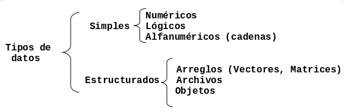
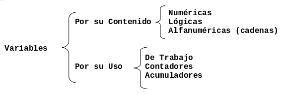

# Entidades Primitivas

En este capítulo aprenderás sobre los elementos básicos para diseñar algoritmos,
como son:

* los **tipos de datos**,
* los **identificadores**,
* las **constantes**,
* las **variables**
* y las **expresiones**.

## Tipos de Datos

Todos los datos en un algoritmo o programa tienen un tipo asociado con ellos.
Un dato puede ser un simple caracter, tal como `b`, o un valor entero tal como
`35`.

El tipo determina el **conjunto de valores que puede tomar un dato** y el
**tipo de operaciones** que se le pueden aplicar. La siguiente Figura muestra
la clasificación general de los tipos de datos de acuerdo a su complejidad.

Algunos tipos de datos estructurados se analizarán en capítulos posteriores,
este Capítulo se enfoca en describir los tipos de datos simples.

### Tipos de Datos Simples

A continuación se detalla el tipo de contenido que corresponde a los tipos de
datos simples.

-   **Datos Numéricos**. Permiten representar valores de forma numérica, esto
    incluye a los números **enteros** y los **reales**. Con este tipo de
    datos se pueden realizar las **operaciones aritméticas comunes**.
-   **Datos Alfanuméricos (Cadenas)**. Estos datos son una secuencia de
    caracteres alfanuméricos, en otras palabras **texto**. Esto incluye
    nombres de personas, direcciones, etc. Es posible representar números como
    alfanuméricos, pero éstos pierden sus propiedades matemáticas, es decir, no
    es posible hacer operaciones aritméticas con datos alfanuméricos. Este
    tipo de datos se representan encerrados entre comillas. Por ejemplo:
    `"Grupo de Usuarios PHP Puebla"`, `"1997"`.
-   **Datos Lógicos**. Son aquellos que sólo pueden tener dos valores:
    **cierto** o **falso** ya que representan el resultado de una
    **comparación** entre otros datos (numéricos o alfanuméricos).

## Identificadores

Los identificadores representan los datos de un programa. Un identificador es
una **secuencia de caracteres que sirve para identificar un dato en la
computadora**.

Ejemplos: `nombre`, `numeroDeHoras`, `calificacion2`

### Reglas para formar un identificador

Los identificadores deben seguir las siguientes reglas:

-   Deben comenzar con una letra (A a Z, mayúsculas o minúsculas) y no deben
    contener espacios en blanco.
-   Letras, dígitos y el guión bajo (`_`) están permitidos después del primer
    caracter.

## Constantes y Variables

Los identificadores sirven para nombrar los dos tipos de elementos más
importantes y más usados en un programa o algoritmo, las constantes y las
variables.

Constante

:   Una constante es un dato numérico o alfanumérico cuyo valor **no cambia**
    dentro de un algoritmo o durante la ejecución de un programa.

    Por ejemplo: `PI = 3.1416`

Variable

:   Es es un valor numérico o alfanumérico cuyo contenido puede **cambiar**
    durante la ejecución de un programa o algoritmo.

    Por ejemplo:

    `perimetro = PI * diametro`

    Las variables son : `diametro` y `perimetro`, la constante es `PI`.

### Notación para Variables y Constantes

Existen varias **formas estándar** de nombrar variables y constantes, a las
cuales se les conoce como **notaciones**. 

Una de las más comunes es la notación *Camel*, la cual consiste en escribir los
identificadores con la primera letra de cada palabra en mayúsculas y el resto
en minúsculas, por ejemplo: `EndOfFile`. Se le llama notación "Camel" porque
los identificadores semejan las jorobas de un camello.

Existen dos variantes de la notación:

-   `UpperCamelCase`: en esta variante la primera letra también es mayúscula.
-   `lowerCamelCase`: en esta variante la primera letra es minúscula.

En muchos lenguajes de programación, se tiene la costumbre de denotar las
constantes mediante identificadores en mayúsculas. En este caso la notación
Camel no es aplicable y solo queda usar la notación **C**, por ejemplo:
`END_OF_FILE`, `PI`, etc.

### Clasificación de las Variables

Las variables se clasifican por su contenido en: **numéricas**, **lógicas** y 
**alfanuméricas** (cadenas); y por su uso en: **variables de trabajo**,
**contadores** y **acumuladores**. La siguiente Figura muestra gráficamente
esta clasificación.

#### Por su contenido

-   **Variable Numéricas.** Son aquellas en las cuales se almacenan valores
    numéricos, positivos o negativos, es decir almacenan secuencias de dígitos
    (números del 0 al 9), signos (+ y -) y el punto decimal. Ejemplo: 
    `salario = 3500.85`, `costo = 2500`, `temperatura = -2`.
-   **Variables Lógicas.** Son aquellas que sólo pueden tener dos valores:
    verdadero o falso (`V` ó `F`), éstos representan el resultado de una
    comparación entre otros datos (operación relacional).
-   **Variables Alfanuméricas.** Variables formadas por caracteres
    alfanuméricos (letras, números y caracteres especiales). Por ejemplo:
    `letra = 'a'`, `apellido = "López"`, `direccion = "Av. Libertad  #190"`.

#### Por su uso

-   **Variables de Trabajo.** Variables que reciben el resultado de una
    operación matemática. Por ejemplo: `suma = a + b / c`.
-   **Contadores.** Se utilizan para llevar el control del número de ocasiones
    en que se realiza una operación. Generalmente este tipo de variable cuenta
    de uno en uno. Por ejemplo:
    `contador = 0`
    `contador = contador + 1`
    `contador = contador + 1`
    `contador = contador + 1`
    La variable `contador` contó 3 veces en este ejemplo.
-   **Acumuladores.** Son variables que sirven para llevar la suma acumulativa
    de una serie de valores que se van leyendo o calculando progresivamente. Por
    ejemplo:
    `deuda = 0`
    `deuda = deuda + 25`
    `deuda = deuda + 5`
    `deuda = deuda + 10`
    En este caso la variable `deuda` acumula la cantidad que se debe a alguien
    y su valor final es 40.

### Ejercicios propuestos

1.  ¿Cuál es la clasificación de los tipos de datos de acuerdo a su complejidad?
2.  Describa el tipo de contenido que pueden almacenar los tipos de datos
    simples.
3.  ¿Qués un identificador y cuáles son las dos reglas básicas para formar un
    identificador.
4.  Defina que es una variable y qué es una constante.
5.  ¿Cual es la notación que se debe usar para una variable y para una
    constante? De un ejemplo de cada una.
6.  ¿Cuál es la clasificación de las variables por su uso y su contenido?
