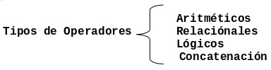
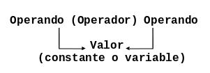

# Entidades Primitivas

En este capítulo se explican los elementos que permiten diseñar algoritmos, como
son: los tipos de datos, las constantes, las variables y las expresiones.

## Tipos de Datos

Todos los datos en un algoritmo o programa tienen un tipo asociado con ellos. Un
dato puede ser un simple carácter, tal como `b`, un valor entero tal como `35`.
El tipo de dato determina la naturaleza del conjunto de valores que puede tomar.
La siguiente Figura muestra la clasificación general de los tipos de datos de
acuerdo a su complejidad.


Los tipos de datos estructurados se analizan en capítulos posteriores, este
Capítulo se enfoca en describir los tipos de datos simples.

### Tipos de Datos Simples

A continuación se detalla el tipo de contenido que corresponde a los tipos de
datos simples.

-   **Datos Numéricos**. Permiten representar valores escalares de forma
    numérica, esto incluye a los números **enteros** y los **reales**. Con este
    tipo de datos se pueden realizar las operaciones aritméticas comunes.
-   **Datos Alfanuméricos (String)**. Estos datos son una secuencia de
    caracteres alfanuméricos que permiten representar valores identificables de
    forma descriptiva, esto incluye nombres de personas, direcciones, etc. Es
    posible representar números como alfanuméricos, pero éstos pierden sus
    propiedades matemáticas, es decir, no es posible hacer operaciones
    aritméticas con datos alfanuméricos. Este tipo de datos se representan
    encerrados entre comillas. Por ejemplo: `"Instituto tecnológico de Puebla"`,
    `"1997"`.
-   **Datos Lógicos**. Son aquellos que sólo pueden tener dos valores (cierto o
    falso) ya que representan el resultado de una comparación entre otros datos
    (numéricos o alfanuméricos).

## Identificadores

Los identificadores representan los datos de un programa. Un identificador es
una **secuencia de caracteres que sirve para identificar una posición en la
memoria de la computadora**, el cual nos permite accesar a su contenido.

Ejemplos: `nombre`, `numeroDeHoras`, `calificacion2`

### Reglas para formar un identificador

Los identificadores no se escriben arbitrariamente, existen un conjunto de
reglas que se deben seguir para formar identificadores correctamente. Las reglas
son las siguientes:

-   Deben comenzar con una letra (A a Z, mayúsculas o minúsculas) y no deben
    contener espacios en blanco.

-   Letras, dígitos y caracteres como el guión bajo (`_`) están permitidos
    después del primer carácter.

## Constantes y Variables

Los identificadores nos sirven para nombrar los dos tipos de elementos más
importantes y más usados de un programa o de un algoritmo, las constantes y las
variables.

Constante

:   Una constante es un dato numérico o alfanumérico cuyo valor no cambia dentro
    de un algoritmo o durante la ejecución de un programa.

    Por ejemplo: `PI = 3.1416`

Variable

:   Es un espacio en la memoria de la computadora que permite almacenar
    temporalmente un dato durante la ejecución de un proceso, su contenido puede
    cambiar durante la ejecución del programa.

Para poder reconocer una variable, es necesario darle un nombre con el cual
podamos identificarla dentro de un algoritmo y que la computadora pueda
localizarla dentro de la memoria. Por ejemplo:

`perimetro = PI * diametro`

Las variables son : `diametro` y `perimetro`, la constante es `PI`.

### Notación para Variables y Constantes

Dentro de las buenas prácticas de programación encontramos la del nombrado
estándar de variables y constantes. Existen varias "formas estándar" de nombrar
variables y constantes, a las cuales se les conoce como notaciones. 

En estas notas se utiliza la notación `CamelCase`. La notación *Camel*
consiste en escribir los identificadores con la primera letra de cada palabra en
mayúsculas y el resto en minúsculas, por ejemplo: `EndOfFile`. Se le llama
notación "Camel" porque los identificadores recuerdan las jorobas de un camello.
Existen dos variantes de la notación:

-   `UpperCamelCase`: en esta variante la primera letra también es mayúscula.
-   `lowerCamelCase`: en esta variante la primera letra es minúscula.

En este documento se opta por utilizar la notación **lowerCamelCase** para los
identificadores de variables.

En muchos lenguajes de programación, se tiene la costumbre de denotar las
constantes mediante identificadores en mayúsculas. En este caso la notación
Camel no es aplicable y solo queda usar la notación **C**, por ejemplo:
`END_OF_FILE`, `PI`, etc.

### Clasificación de las Variables

Las variables se clasifican por su contenido en: **numéricas**, **lógicas** y 
**alfanuméricas** (string); y por su uso en: **variables de trabajo**,
**contadores** y **acumuladores**. La siguiente Figura muestra gráficamente esta
clasificación.


#### Por su contenido

-   **Variable Numéricas.** Son aquellas en las cuales se almacenan valores
    numéricos, positivos o negativos, es decir almacenan secuencias de dígitos
    (números del 0 al 9), signos (+ y -) y el punto decimal. Ejemplo: 
    `iva = 0.15`, `salario = 3500.85`, `costo = 2500`.
-   **Variables Lógicas.** Son aquellas que sólo pueden tener dos valores:
    verdadero o falso (V ó F), éstos representan el resultado de una comparación
    entre otros datos (operación relacional).
-   **Variables Alfanuméricas.** Variables formadas por caracteres alfanuméricos
    (letras, números y caracteres especiales). Por ejemplo: `letra = 'a'` 
    `apellido = "López"`, `direccion = "Av. Libertad  #190"`.

#### Por su uso

-   **Variables de Trabajo.** Variables que reciben el resultado de una
    operación matemática completa. Por ejemplo: `suma = a + b / c`.
-   **Contadores.** Se utilizan para llevar el control del número de ocasiones
    en que se realiza una operación o se cumple una condición. Con los
    incrementos generalmente de uno en uno. Por ejemplo:
    `contador = contador + 1`.
-   **Acumuladores.** Forma que toma una variable y que sirve para llevar la
    suma acumulativa de una serie de valores que se van leyendo o calculando
    progresivamente. Por ejemplo: `acumulador = acumulador + cantidad`.

## Expresiones

Las expresiones son combinaciones de constantes, variables, símbolos de
operación, paréntesis y nombres de funciones especiales. Por ejemplo:
`a + (b + 3) / c`.

Cada expresión toma un valor que se determina tomando los valores de las
variables y constantes implicadas y la ejecución de las operaciones indicadas.

Una expresión consta de operadores y operandos. Según sea el tipo de datos que
manipulan, las expresiones se clasifican en:

-   Aritméticas
-   Relacionales
-   Lógicas

## Operadores y Operandos

Los operadores son elementos que relacionan de forma diferente, los valores de
una o mas variables y/o constantes. Es decir, los operadores nos permiten
manipular valores y se dividen en tres grupos como se muestra en la siguiente
Figura:



### Operadores Aritméticos

Los operadores aritméticos permiten realizar de operaciones matemáticas sobre
valores (variables y constantes). La forma general que tiene una operación
aritmética que opera sobre dos valores se ilustra en la siguiente Figura:



Los operadores aritméticos pueden ser utilizados con tipos de datos enteros o
reales. Si ambos son **enteros**, el resultado es **entero**; si alguno de ellos
es **real**, el resultado es **real**. Las operaciones aritméticas son las
siguientes:

-   Suma: `+`
-   Resta: `-`
-   Multiplicación: `*`
-   División: `/`
-   Módulo (residuo de la división entera): `%`

Ejemplos:

| Expresión    | Resultado |
| ------------ | --------- |
| `7 / 2`      | `3.5`     |
| `12 % 7`     | `5`       |
| `4  + 2 * 5` | `14`      |

#### Prioridad de los Operadores Aritméticos

Las operaciones aritméticas deben evaluarse de acuerdo a la importancia del
operador, es decir, de acuerdo a su prioridad, de la siguiente forma:

-   Todas las expresiones entre paréntesis se evalúan primero.
-   Las expresiones con paréntesis anidados se evalúan de adentro hacia afuera,
    el paréntesis más interno se evalúa primero.
-   Dentro de una misma expresión los operadores se evalúan en el siguiente
    orden.
    1.  Exponenciación: `^`
    2.  Multiplicación, división, modulo: `*`, `/`, `%`
    3.  Suma y resta: `+`, `-`
-   Los operadores en una misma expresión con igual nivel de prioridad se
    evalúan de izquierda a derecha.

#### Ejemplos

```
4 + 2 * 5 = 14
4 + 10 = 14
23 * 4 / 2 = 46
92 / 2 = 46
3 + 5 * (10 - (2 + 4)) = 23
3 + 5 * (10 - 6) = 3 + 5 * 4 = 3 + 20 = 23
3 + 5 - 14 / 2 = 1
3 + 5 - 7 = 8 - 7 = 1
2 * (1 + 3 * 4) = 26
2 * (1 + 12) = 2 * 13 = 26
```

### Operadores Relacionales

Los operadores relacionales se utilizan para establecer una relación entre dos
valores. Los valores se comparan entre sí y esta comparación produce un
resultado de certeza o falsedad (verdadero o falso).

Los operadores relacionales deben comparan valores del mismo tipo (numéricos o
cadenas), tienen el mismo nivel de prioridad en su evaluación y tienen menor
prioridad que los operadores aritméticos.

Las operaciones relacionales son las siguientes:

-   `>` Mayor que
-   `<` Menor que
-   `>=` Mayor o igual que
-   `<=` Menor o igual que
-   `!=` Diferente
-   `==` Igual

#### Ejemplos

Si a = 10, b = 20 y c = 30.

`a + b > c`

Falso

`a - b < c`

Verdadero

`a - b == c`

Falso

`a * b != c`

Verdadero

Ejemplos no válidos:

`a < b < c`

`10 < 20 < 30`

`'hola' < 30`

### Operadores Lógicos

Los operadores lógicos se utilizan para establecer relaciones entre valores
lógicos. Estos valores pueden ser resultado de una expresión relacional.

Las operaciones lógicas son las siguientes:

-   Conjunción: **And**, `&`
-   Disyunción: **OR**, `|`
-   Negación: **Not**, `!`

A continuación se muestran las tablas de verdad para las operaciones lógicas.

| Operando 1 | Operador | Operando 2 | Resultado |
| ---------- | -------- | ---------- | --------- |
| `V`        | `AND`    | `V`        | `V`       |
| `F`        | `AND`    | `V`        | `F`       |
| `V`        | `AND`    | `F`        | `F`       |
| `F`        | `AND`    | `F`        | `F`       |
| ---------- | -------- | ---------- | --------- |
| `V`        | `OR`     | `V`        | `V`       |
| `F`        | `OR`     | `V`        | `V`       |
| `V`        | `OR`     | `F`        | `V`       |
| `F`        | `OR`     | `F`        | `F`       |
| ---------- | -------- | ---------- | --------- |
|            | `NOT`    | `V`        | `F`       |
|            | `NOT`    | `F`        | `V`       |

Ejemplos: Sea `a = 10`, `b = 20` y `c = 30`.

```
 a < b  & b  < c
10 < 20 & 20 < 30
   V    &    V
        V
```

#### Prioridad de los Operadores Lógicos

Los operadores relacionales se evaluán en el siguiente orden.

-   Not `!`

-   And `&`

-   OR `|`

#### Prioridad de los Operadores en General

A continuación se hace un resumen de la prioridad de los operadores aritméticos,
relacionales y lógicos.

1.  `()`

2.  `^`

3.  `*`, `/`, `%`, `!`

4.  `+`, `-`, `&`

5.  `>`, `<`, `>=`, `<=`, `!=`, `==`, `|`

Ejemplos:

Sean `a = 10`, `b = 12`, `c = 13`, y `d = 10`.

```   
((a  > b)  | (a < c))   & ((a == c)   | (a >= b))
((10 > 12) | (10 < 13)) & ((10 == 13) | (10 >= 12))
(    F     |      V   ) & (     F     |     F     ) 
           V            &             F
                        F
```

```
((a  >= b)  | (a < d))   & ((a >= d)   & (c  > d ))
((10 >= 12) | (10 < 10)) & ((10 >= 10) & (13 > 10))
(    F      |     F    ) & (    V      &     V    )    
            F            &             V
                         F
```

```
!(a == c)   & (c  > b)
!(10 == 13) & (13 > 12)
     !F     &     V
     V      &     V
            V
```

### Ejercicios propuestos

1.  ¿Cuál es la clasificación de los tipos de datos de acuerdo a su complejidad?
2.  Describa el tipo de contenido que pueden almacenar los tipos de datos
    simples.
3.  ¿Qués un identificador y cuáles son las dos reglas básicas para formar un
    identificador.
4.  Defina que es una variable y qué es una constante.
5.  ¿Cual es la notación que se debe usar para una variable y para una
    constante? De un ejemplo de cada una.
6.  ¿Cuál es la clasificación de las variables por su uso y su contenido?
7.  ¿Que es una expresión y cuál es su clasificación?
8.  Realice las siguientes operaciones aritméticas:
```
2 + 9 * 3 - 100 / 5
((6 * 10 - 45 + 80) / 10) / (((12 + 3) * 5 -45) / 9)
(((2^10 - 1000) + 76) / (120 - 90 + (25 * 4 / 20))) / 5 + 10
(20 - 40 + (25 / 5 * 20) / (2 * 10 - 1000 / 50) + 40) / ((6 + 10) / (20 * 10 / 50 * 2))
```
9.  Realice las siguientes operaciones relacionales, con `a = 10`, `b = 5` y
    `c = 20`:
```
(2 * a / 2 * b) / (a - 5 * a * b + c) > (a + 2 * b + c) - (b + c * 8)
(2 * a - 5 * b) / (4 * c - 5 * a * b + 10) <= (a * b * c) / (a + b + c)
(10 * a + 5 + b) / (c - 5 * a * b + 10) != (a + b * c) - (a * b + c) / (5 * a)
10 / (a + b + c) + 3 * a * b * c == 10 * c - 2 * a * b + 6
```
10. Realice las siguientes operaciones lógicas, con `a = 1`, `b = 2` y `c = 4`:
```
(2 * a) / (5 * b + 10) > 3 * a + c && 3 * a * b * c >= 200
a / (5 * b) <= 3 * a + c || a * b * c >= 200 && !(a + b * c >= 350 * c)
a / (b + c) != 10 * b + a || a + 5 * b * a >= 5 * b / 2 && !(a + b != 2 * c)
(2 + a) / (5 * b + c) >= 3 + 2 * a && !(5 + 2 * c < 3 * a) && !(3 + a <= 5 * b + c)
```
