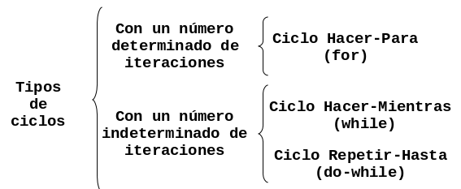

# Estructuras Cíclicas

Se llaman problemas repetitivos o cíclicos a aquellos en cuya solución es
necesario utilizar un mismo conjunto de acciones que se puedan ejecutar una
cantidad especifica de veces. Esta cantidad puede ser fija (previamente
determinada por el programador) o puede ser variable (estar en función de algún
dato dentro del programa).Los ciclos se clasifican como lo ilustra la siguiente
figura:



## Ciclo Hacer-Para

Los ciclos con un determinado número de iteraciones son aquellos en que el
número de iteraciones se conoce antes de ejecutarse el ciclo. La forma de esta
estructura es la siguiente:

```
Para variableControl = valorInicial hasta limite Hacer
Inicio-para
    Accion1
    Accion2
        .
        .
        .
    AccionN
Fin-para
```

Donde:

-   `variableControl` es la variable de control del ciclo, la cual nos permite
    llevar la cuenta de cuantas iteraciones se han realizado en todo momento.
-   `valorInicial` es el valor desde donde empezará a contar la variable de
    control.
-   `limite` es el valor que necesita alcanzar la variable de control para
    terminar el ciclo.

En este ciclo la variable de control toma el valor inicial del ciclo y el ciclo
se repite hasta que la variable de control llegue al limite superior.

### Problemas Hacer Para

1.  Calcular el promedio de un alumno que tiene 7 calificaciones en la
    materia de Diseño Estructurado de Algoritmos
    ```
    Inicio
        Sum =0
        Leer Nom
        Hacer para c = 1 a 7
            Leer calif
            Sum = sum + calif
        Fin-para
        prom = sum /7
        Imprimir prom
    Fin.
    ```
2.  Leer 10 números y obtener su cubo y su cuarta.
    ```
    Inicio
        Hacer para n = 1 a 10
            Leer num
            cubo = num * num * num
            cuarta = cubo * num
            Imprimir cubo, cuarta
        Fin-para
    Fin.
    ```
3.  Leer 10 números e imprimir solamente los números positivos
    ```
    Inicio
        Hacer para n = 1 a 10
            Leer num
            Si num > 0 entonces
                Imprimir num
            fin-si
        Fin-para
    Fin.
    ```
4.  Leer 20 números e imprimir cuantos son positivos, cuantos negativos y
    cuantos neutros.
    ```
    Inicio
       cn = 0
       cp = 0
       cneg = 0
       Hacer para x = 1 a 20
        Leer num
        Sin num = 0 entonces
            cn = cn + 1
                 si no
            Si num > 0 entonces
                cp = cp + 1
                     si no
                cneg = cneg + 1
            Fin-si
        Fin-si
       Fin-para
       Imprimir cn, cp, cneg
    Fin.
    ```
5.  Leer 15 números negativos, convertirlos a positivos e imprimirlos.
    ```
    Inicio
       Hacer para x = 1 a 15
        Leer num
        pos = num * -1
        Imprimir num, pos
       Fin-para
    Fin.
    ```
6.  Suponga que se tiene un conjunto de calificaciones de un grupo de 40
    alumnos. Realizar un algoritmo para calcular la calificación media y la
    calificación mas baja de todo el grupo.
    ```
    Inicio
       sum = 0
       baja = 9999
       Hacer para a = 1 a 40
        Leer calif
        sum = sum + calif
        Si calif < baja entonces
            baja = calif
        fin-si
       Fin-para
       media = sum / 2
       Imprimir media, baja
    fin
    ```
7.  Calcular e imprimir la tabla de multiplicar de un número cualquiera.
    Imprimir el multiplicando, el multiplicador y el producto.
    ```
    Inicio
       Leer num
       Hacer para X = 1 a 10
        resul = num * x
            Imprimir num, " * ", X, " = ", resul
       Fin-para
    fin.
    ```
8.  Simular el comportamiento de un reloj digital, imprimiendo la hora, minutos
    y segundos de un día desde las 0:00:00 horas hasta las 23:59:59 horas
    ```
    Inicio
       Hacer para h = 1 a 23
          Hacer para m = 1 a 59
        Hacer para s = 1 a 59
           Imprimir h, m, s
        Fin-para
          Fin-para
       Fin-para
    fin.
    ```

### Problemas Propuestos

1.  Una persona debe realizar un muestreo con 50 personas para determinar el
    promedio de peso de los niños, jóvenes, adultos y viejos que existen en su
    zona habitacional. Se determinan las categorías con base en la sig, tabla:

    | Categoría | Edad |
    | --------- | ---- |
    | Niños | 0 - 12 |
    | Jóvenes | 13 - 29 |
    | Adultos | 30 - 59 |
    | Viejos | 60 en adelante |

2.  Al cerrar un expendio de naranjas, 15 clientes que aún no han pagado
    recibirán un 15% de descuento si compran más de 10 kilos. Determinar cuanto
    pagará cada cliente y cuanto percibirá la tienda por esas compras.
3.  En un centro de verificación de automóviles se desea saber el promedio de
    puntos contaminantes de los primeros 25 automóviles que lleguen. Asimismo se
    desea saber los puntos contaminantes del carro que menos contamino y del que
    más contamino.
4.  Un entrenador le ha propuesto a un atleta recorrer una ruta de cinco
    kilómetros durante 10 días, para determinar si es apto para la prueba de 5
    Kilómetros o debe buscar otra especialidad. Para considerarlo apto debe
    cumplir por lo menos una de las siguientes condiciones:

    -   Que en ninguna de las pruebas haga un tiempo mayor a 16 minutos.
    -   Que al menos en una de las pruebas realice un tiempo mayor a 16
        minutos.
    -   Que su promedio de tiempos sea menor o igual a 15 minutos.

5.  Un Zoólogo pretende determinar el porcentaje de animales que hay en las
    siguientes tres categorías de edades: de 0 a 1 año, de mas de 1 año y menos
    de 3 y de 3 o mas años. El zoológico todavía no esta seguro del animal que
    va a estudiar. Si se decide por elefantes solo tomará una muestra de 20 de
    ellos; si se decide por las jirafas, tomara 15 muestras, y si son chimpancés
    tomara 40.

## Ciclo Hacer-Mientras

Los ciclos con un número indeterminado de iteraciones son aquellos en que el
número de iteraciones no se conoce con exactitud, ya que esta dado en función de
un dato dentro del programa. Para este tipo de problemas se cuenta con dos
estructuras algorítmicas: el ciclo `Hacer-mientras`, y el ciclo `Repetir-hasta`.

El ciclo `Hacer-Mientras` es una estructura que repetirá un proceso "N" veces,
donde "N" puede ser fijo o variable. Para esto, la instrucción se vale de una
condición que es la que debe cumplirse para que se siga ejecutando. Cuando la
condición ya no se cumple, entonces ya no se ejecuta el proceso. La forma de
esta estructura es la siguiente:

```
hacer mientras <condicion>
inicio-mientras
    <acciones-mientras>
fin-mientras
```

### Problemas Hacer-Mientras

1.  Una compañía de seguros tiene contratados a n vendedores. Cada uno hace tres
    ventas a la semana. Su política de pagos es que un vendedor recibe un sueldo
    base, y un 10% extra por comisiones de sus ventas. El gerente de su compañía
    desea saber cuanto dinero obtendrá en la semana cada vendedor por concepto
    de comisiones por las tres ventas realizadas, y cuanto tomando en cuenta su
    sueldo base y sus comisiones.
2.  En una empresa se requiere calcular el salario semanal de cada uno de los n
    obreros que laboran en ella. El salario se obtiene de la siguiente forma:
    -   Si el obrero trabaja 40 horas o menos se le paga $20 por hora.
    -   Si trabaja mas de 40 horas se le paga $20 por cada una de las primeras
        40 horas y $25 por cada hora extra.
3.  Determinar cuantos hombres y cuantas mujeres se encuentran en un grupo de n
    personas, suponiendo que los datos son extraídos alumno por alumno.
4.  El Departamento de Seguridad Publica y Transito del D. F . desea saber, de
    los n autos que entran a la ciudad de México, cuantos entran con calcomanía
    de cada color. Conociendo el ultimo dígito de la placa de cada automóvil se
    puede determinar el color de la calcomanía utilizando la siguiente relación:

    | Dígito | Color |
    | ------ | ----- |
    | 1 o 2 | amarilla |
    | 3 o 4 | rosa |
    | 5 o 6 | roja |
    | 7 o 8 | verde |
    | 9 o 0 | azul |

5.  Obtener el promedio de calificaciones de un grupo de n alumnos.
6.  Una persona desea invertir su dinero en un banco, el cual le otorga un 2% de
    interés. ¿Cual será la cantidad de dinero que esta persona tendrá al cabo de
    un año si la ganancia de cada mes es reinvertida?.
7.  Calcular el promedio de edades de hombres, mujeres y de todo un grupo de
    alumnos.
8.  Encontrar el menor valor de un conjunto de n números dados.
9.  Encontrar el mayor valor de un conjunto de n números dados.
10. En un supermercado un cajero captura los precios de los artículos que los
    clientes compran e indica a cada cliente cual es el monto de lo que deben
    pagar. Al final del día le indica a su supervisor cuanto fue lo que cobro en
    total a todos los clientes que pasaron por su caja.
11. Cinco miembros de un club contra la obesidad desean saber cuanto han bajado
    o subido de peso desde la ultima vez que se reunieron. Para esto se debe
    realizar un ritual de pesaje en donde cada uno se pesa en diez básculas
    distintas para así tener el promedio mas exacto de su peso. Si existe
    diferencia positiva entre este promedio de peso y el peso de la ultima vez
    que se reunieron, significa que subieron de peso. Pero si la diferencia es
    negativa, significa que bajaron. Lo que el problema requiere es que por cada
    persona se imprima un letrero que diga: “SUBIO” o “BAJO” y la cantidad de
    kilos que subió o bajo de peso.
12. Se desea obtener el promedio de g grupos que están en un mismo año escolar;
    siendo que cada grupo puede tener n alumnos que cada alumno puede llevar m
    materias y que en todas las materias se promedian tres calificaciones para
    obtener el promedio de la materia. Lo que se desea desplegar es el promedio
    de los grupos, el promedio de cada grupo y el promedio de cada alumno.

## Ciclo Repetir-Hasta

El ciclo `Repetir-Hasta` es una estructura similar en algunas características, a
la anterior. Repite un proceso una cantidad de veces, pero a diferencia del
`Hacer-Mientras`, el `Repetir-Hasta` lo hace hasta que la condición se cumple y
no mientras, como en el `Hacer-Mientras`. Por otra parte, esta estructura
permite realizar el proceso cuando menos una vez, ya que la condición se evalúa
al final del proceso, mientras que en el `Hacer-Mientras` puede ser que nunca
llegue a entrar si la condición no se cumple desde un principio. La forma de
esta estructura es la siguiente:

```
Repetir
    Accion1
    Accion2
        .
        .
    Accion N
Hasta <condicion>
```

### Problemas Repetir-Hasta

1.  En una tienda de descuento las personas que van a pagar el importe de su
    compra llegan a la caja y sacan una bolita de color, que les dirá que
    descuento tendrán sobre el total de su compra. Determinar la cantidad que
    pagará cada cliente desde que la tienda abre hasta que cierra. Se sabe que
    si el color de la bolita es roja el cliente obtendrá un 40% de descuento; si
    es amarilla un 25% y si es blanca no obtendrá descuento.
2.  En un supermercado una ama de casa pone en su carrito los artículos que va
    tomando de los estantes. La señora quiere asegurarse de no sobrepasar la
    cantidad de dinero que lleva, por lo que cada vez que toma un artículo anota
    su precio junto con la cantidad de artículos iguales que ha tomado y
    determina cuanto dinero gastará en ese artículo; a esto le suma lo que irá
    gastando en los demás artículos. Ayúdale a esta señora a no gastar más
    dinero del que lleva y obtener el total de sus compras y el cambio que
    recibirá.
3.  Un teatro otorga descuentos según la edad del cliente. determinar la
    cantidad de dinero que el teatro deja de percibir por cada una de las
    categorías. Tomar en cuenta que los niños menores de 5 años no pueden entrar
    al teatro y que existe un precio único en los asientos. Los descuentos se
    hacen tomando en cuenta el siguiente cuadro:

    | Edad | Descuento |
    | ---- | --------- |
    | Categoría 1 de 5 - 14 | 35% |
    | Categoría 2 de 15 - 19 | 25% |
    | Categoría 3 de 20 - 45 | 10% |
    | Categoría 4 de 46 - 65 | 25% |
    | Categoría 5 de 66 en adelante | 35% |

### Problemas Propuestos

1.  La presión, volumen y temperatura de una masa de aire se relacionan
    por la formula:

    `masa = presion * volumen / (0.37 * (temperatura + 460))`

    Calcular el promedio de masa de aire de los neumáticos de n vehículos que
    están en compostura en un servicio de alineación y balanceo. Los vehículos
    pueden ser motocicletas o automóviles.
2.  Determinar la cantidad semanal de dinero que recibirá cada uno de los n
    obreros de una empresa. Se sabe que cuando las horas de trabajo un obrero
    exceden de 40, el resto se convierte en horas extras que se pagan al doble
    de una hora normal, cuando no exceden de 8; cuando las horas extras exceden
    de 8 se pagan las primeras 8 al doble de lo que se paga por una hora normal
    y el resto al triple.
3.  En una granja se requiere saber alguna información para determinar el precio
    de venta por cada kilo de huevo. Es importante determinar el promedio de
    calidad de las n gallinas que hay en la granja. La calidad de cada gallina
    se obtiene según la formula:

    `calidad = pesoGallina * alturaGallina / numeroHuevos`

    Finalmente para fijar el precio del kilo de huevo, se toma como base la
    siguiente tabla:

    | Calidad | Precio por kilo |
    | ------- | --------------- |
    | mayor o igual que 15 | 1.2 * promedio de calidad |
    | mayor que 8 y menor que 15 | 1.00 * promedio de calidad |
    | menor o igual que 8 | 0.80 * promedio de calidad |

4.  En la Cámara de Diputados se levanta una encuesta con todos los integrantes
    con el fin de determinar que porcentaje de los n diputados está a favor del
    Tratado de Libre Comercio, que porcentaje está en contra y que porcentaje se
    abstiene de opinar.
5.  Una persona que va de compras a la tienda "Enano, S.A.", decide llevar un
    control sobre lo que va comprando, para saber la cantidad de dinero que
    tendrá que pagar al llegar a la caja. La tienda tiene una promoción del 20%
    de descuento sobre aquellos artículos cuya etiqueta sea roja. Determinar la
    cantidad de dinero que esta persona deberá pagar.
6.  Un censador recopila ciertos datos aplicando encuestas para el último Censo
    Nacional de Población y Vivienda. Desea obtener de todas las personas que
    alcance a encuestar en un día, que porcentaje tiene estudios de primaria,
    secundaria, carrera técnica, estudios profesionales y estudios de postgrado.
7.  Un jefe de casilla desea determinar cuantas personas de cada una de las
    secciones que componen su zona asisten el día de las votaciones. Las
    secciones son: norte, sur y centro. También desea determinar cual es la
    sección con mayor numero de votantes.
8.  Un negocio de copias tiene un limite de producción diaria de 10,000 copias
    si el tipo de impresión es offset y de 50,000 si el tipo es estándar. Si hay
    una solicitud, el empleado tiene que verificar que las copias pendientes
    hasta el momento y las copias solicitadas no excedan del límite de
    producción. Si el límite de producción se excediera el trabajo solicitado no
    podría ser aceptado. El empleado necesita llevar un buen control de las
    copias solicitadas hasta el momento para decidir en forma rápida si los
    trabajos que se soliciten en el día se deben aceptar o no.
9.  Calcular la suma siguiente:

    `100 + 98 + 96 + 94 + . . . + 0` en ese orden

10. Leer n calificaciones de un grupo de alumnos. Calcule y escriba el
    porcentaje de reprobados. Tomando en cuenta que la calificación mínima
    aprobatoria es de 70.
11. Leer por cada alumno de Diseño estructurado de algoritmos su numero de
    control y su calificación en cada una de las 5 unidades de la materia. Al
    final que escriba el número de control del alumno que obtuvo mayor promedio.
    Suponga que los alumnos tienen diferentes promedios.
12. El profesor de una materia desea conocer la cantidad de sus alumnos que no
    tienen derecho al examen de nivelación. Diseñe un algoritmo que lea las
    calificaciones obtenidas en las 5 unidades por cada uno de los 40 alumnos y
    escriba la cantidad de ellos que no tienen derecho al examen de nivelación.
13. Leer los 250,000 votos otorgados a los 3 candidatos a gobernador e imprimir
    el numero del candidato ganador y su cantidad de votos.
14. Suponga que tiene usted una tienda y desea registrar las ventas en su
    computadora. Diseñe un algoritmo que lea por cada cliente, el monto total de
    su compra. Al final del día que escriba la cantidad total de ventas y el
    número de clientes atendidos.
