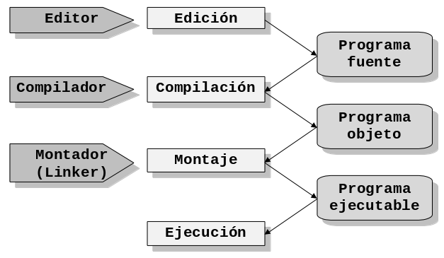
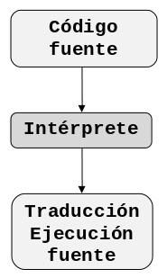

# El lenguaje de programación C

EL lenguaje C es el resultado de un proceso de desarrollo que inició con un
lenguaje denominado BCPL escrito por Martin Richards. Este influenció a otro
llamado B (inventado por Ken Thompson). En los años 70’s para el primer sistema
UNIX en un DEC PDP-7; éste lenguaje llevó a la aparición de C. El primer
compilador de C fue escrito por Kernighan y Dennis Ritchie en 1972 en la ATT
para un DEC PDP-11 y escribió el propio sistema operativo en C.

Con la popularidad de las microcomputadoras muchas compañías comenzaron a
implementar su propio C por lo cual surgieron discrepancias entre sí. Por esta
razón el ANSI (**American National Standars Institute**), estableció un comité
en 1983 para crear una definición no ambigua del lenguaje C e independiente de
la máquina que pudiera utilizarse en todos los tipos de C. Algunos de las C
existentes son:

-   Ansi C
-   Zortech C++
-   Quick C
-   C++
-   Turbo C
-   Turbo C++
-   Borland C
-   Microsoft C
-   Visual C
-   C Builder

C es un lenguaje de programación de nivel medio ya que combina los elementos del
lenguaje de alto nivel con la funcionalidad del ensamblador. Su característica
principal es ser portable, es decir, es posible adaptar los programas escritos
para un tipo de computadora en otra. Otra de sus características principales es
el ser estructurado. El lenguaje C inicialmente fue creado para la programación
de:

-   Sistemas operativos
-   Intérpretes
-   Editores
-   Ensambladores
-   Compiladores
-   Administradores de bases de datos

Actualmente, debido a sus características, puede ser utilizado para todo tipo de
programas.

## Traductores de programas

Los traductores son programas que traducen los programas en código fuente,
escritos en lenguajes de alto nivel, a programas escritos en lenguaje máquina.
Los traductores pueden ser de dos tipos: compiladores e interpretes

### Compiladores

Un **compilador es un programa que traduce** un programa escrito en un lenguaje
de programación, llamado **lenguaje fuente**, a otro lenguaje de programación,
llamado **lenguaje objeto**, generando un programa equivalente que la máquina
será capaz de interpretar. Usualmente el segundo lenguaje es lenguaje de máquina,
pero también puede ser simplemente texto.

Además el compilador realiza una comprobación de errores en el programa, es
decir, revisa que todo este en orden por ejemplo **variables e instrucciones
bien definidas**, revisa todo lo referente a **cuestiones sintácticas**. Está
fuera del alcance del compilador verificar que el algoritmo utilizado en el
programa funcione bien. A este proceso de traducción se le conoce como
**compilación**. La siguiente figura ilustra el proceso de compilación descrito.


De esta manera un programador puede diseñar un programa en un lenguaje mucho más
cercano a como piensa un ser humano, para luego compilarlo a un programa
manejable por una computadora.

Entrando en más detalle un programa se captura en un editor, el cual produce un
programa fuente, que a su vez es compilado obteniendo un archivo parcial (**un
programa objeto**) que tiene extensión *.obj* luego el compilador invoca al
montador **linker** que convierte el programa objeto en un programa ejecutable
con extensión *.exe* que como ya sabemos es un archivo que esta en formato
binario (ceros y unos) y que puede funcionar por sí solo. La siguiente figura
muestra los pasos que se suceden para obtener un programa ejecutable desde el
código fuente:



### Intérpretes

Un intérprete es un programa capaz de **analizar y ejecutar programas escritos
en un lenguaje de alto nivel**. Los intérpretes se diferencian de los
compiladores en que mientras los compiladores traducen un programa desde un
lenguaje de programación a código máquina, los primeros (los interpretes) sólo
realizan la traducción a medida que sea necesario, típicamente, **instrucción
por instrucción**, y normalmente no guardan el resultado de dicha traducción. La
siguiente figura describe el proceso realizado por un intérprete.



Los programas interpretados suelen ser **más lentos** que los compilados debido
a la necesidad de traducir el programa mientras se ejecuta, pero a cambio
**son más flexibles como entornos de programación y depuración** (lo que se
traduce, por ejemplo, en una mayor facilidad para reemplazar o agregar partes
enteras a un programa), y permiten ofrecer al programa interpretado un **entorno
independiente de la máquina donde se ejecuta el intérprete** (lo que se conoce
comúnmente como **máquina virtual**).

Comparando su actuación con la de un ser humano, **un compilador equivale a un
traductor profesional** que, a partir de un texto, prepara otro independiente
traducido a otra lengua, mientras que un **intérprete corresponde al intérprete
humano**, que traduce de viva voz las palabras que oye, sin dejar constancia por
escrito.

### Puesta a punto de un programa

La puesta a punto del programa hace referencia a la **localización**,
**verificación** y **corrección de errores de programación** para obtener un
programa que funcione correctamente. La puesta a punto consta de las siguientes
etapas:

1.  **Detección de errores**. Esta etapa ocurre al compilar o ejecutar un
    programa. Sirve para verificar que el programa está bien escrito (al
    compilar) y que devuelve resultados correctos (al ejecutar).
2.  **Depuración de errores**. Esta fase consta de dos partes:
    -   **Localización**. Consiste en ubicar la(s) línea(s) de código que
        está(n) mal escrita(s) o que está(n) produciendo resultados incorrectos.
    -   **Eliminación**. Una vez ubicado el error se prosigue a corregirlo.
3.  **Prueba del programa**. Después de ubicar y corregir los errores se debe
   comprobar que los cambios fueron pertinentes. En caso de encontrar o producir
   nuevos errores se debe volver al paso 1.

Los errores típicos que se presentan en un programa son:

-   Errores de sintaxis
-   Errores de lógica

#### Errores de sintaxis

Los errores de sintaxis se originan en el momento de **compilación/interpretación**
 del programa y se deben a **causas propias de la sintaxis del lenguaje** como
escrituras incorrectas de instrucciones, omisión de signos, etc. Estos errores
se descubren con **facilidad**.

#### Errores de lógica

Los errores en la lógica del programa pueden ser producidos en la fase de
**compilación** o **ejecución**. Los que suceden durante la ejecución de un
programa, normalmente, son más **difíciles de detectar**. Se pueden observar dos
categorías: los que **detienen la ejecución del programa** y **los que no la
detienen**, pero que producen resultados erróneos.

-   Por ejemplo: si se tiene la asignación `r = s / c` y `c` es cero, se produce
    un error de **división por cero**. Muchos de los errores lógicos solo se
    manifiestan en el momento de la ejecución; por ello se denominan también
    errores de ejecución.
-   Un ejemplo más puede ocurrir con la asignación `l = 2 * p * r`. Si se omite
    el segundo símbolo del producto, la instrucción se convierte en `l = 2 * pr`,
    la omisión de este símbolo no se reconoce como error de sintaxis en la fase
    de compilación o interpretación, pero daría resultados erróneos al ejecutarse.

## Elementos básicos de un programa

En el ámbito general, un programa codificado o escrito bajo cualquier lenguaje
de programación estructurado consta básicamente de dos secciones:

-   Sección de encabezado
-   Sección de cuerpo de programa

### La sección de encabezado

La sección de **encabezado** es usada para **declarar las variables y/o
constantes** (con sus respectivos **tipos**) que se vayan a utilizar en el
programa, así como también el nombre de las funciones y/o procedimientos[^3] que
ejecutarán las instrucciones de los algoritmos que incluye dicho programa.
Además en esta sección se declaran los **archivos de inclusión** (archivos
generalmente con extensión `.h` hablando de lenguaje C) que permiten el uso de
algunas funciones que son necesarias para el desarrollo del programa. Igualmente
se especifican las estructuras de datos complejas que se vayan a manejar.

### La sección de cuerpo de programa

En la sección cuerpo de programa realmente se describen todos los procedimientos
y/o funciones que se van a ejecutar dentro del programa así como también el
código del **programa principal**. En un cuerpo de programa es **obligatorio**
que haya una **parte principal** delimitada por `Begin ... End` para Pascal ó
`void main() { ... }` para lenguaje C, mientras que los procedimientos y/o
funciones son opcionales.

## Elementos de un programa en C

El siguiente ejemplo ilustra algunos de los componentes que con mayor
frecuencia se usan cuando se trata de codificar programas utilizando el
lenguaje de programación C.

```C
 #include<stdio.h>

 /**
  * Programa que lee un numero ingresado por teclado
  * y lo muestra en pantalla
  */
 void main() {
    int numero;
    printf("Digite un numero entre 1 y 100");
    scanf("%d",&numero);
    printf("\n El numero que ingresó es: %d",numero);
 }
```

En las secciones siguientes se explican cada una de las partes de este ejemplo.

### La directiva `#include`

La directiva `#include` da instrucciones al compilador C para que añada el
contenido de un **archivo de inclusión** al programa durante la compilación. Un
archivo de inclusión es un archivo contiene información necesaria para el
compilador. Varios de estos archivos (algunas veces llamados archivos de
encabezado) se proporcionan con el compilador. **Nunca** se necesita modificar
la información de estos archivos y esta es la razón por la cual se mantienen
separados del código fuente. Todos los archivos de inclusión deben tener la
extensión `.h` por ejemplo `#include <stdio.h>`. En el caso del archivo de
inclusión `stdio.h` le indica al compilador que se han incluido funciones
estándares `std` de entrada `i = input` y salida `o = output` que podrá utilizar
en el desarrollo del programa por ejemplo funciones como `printf()` y `scanf()`.

La directiva `#include`, en este programa de ejemplo, significa "añada el
contenido del archivo `stdio.h`".

### La función `main`

La palabra `main` es muy importante y debe aparecer solo una vez en todo
programa C. En C, todo el código está basado en funciones. El programa principal
no es la excepción. `main()` indica el comienzo de la función principal del
programa la cual se *delimita con llaves*. Este componente es obligatorio en
cualquier programa que se compile con lenguaje C. En su forma simple la función
`main` consiste en la palabra `void`, la cual indica que la función `main` no
devuelve ningún valor como resultado, seguida de la palabra `main`, la cual
representa el nombre de la función, seguida de paréntesis `()` y las
instrucciones que ejecutan se encuentran demarcadas por las dos llaves `{` para
indicar **Inicio** y `}` para indicar **Fin**.

### Definición de identificadores

**Un identificador es un nombre asignado a una posición de almacenamiento de
datos** (variable o constante). El programa utiliza variables para guardar
varios tipos de datos durante la ejecución del programa. En C, **una variable
debe definirse antes de que pueda ser usada**. Una definición de variable le
informa al compilador el nombre de la variable y el tipo de datos que va a
guardar. En el programa de ejemplo la definición de la línea `int numero;`
define una variable, llamada `numero` que guardará un valor de tipo entero.

Las variables se pueden declarar en la zona de encabezado de un programa o al
inicio de una función o un procedimiento. Dos reglas se deben tener en mente
cuando se definen los identificadores son:

1.  El "tamaño" de los caracteres alfabéticos es importante. Usar `PRINCIPAL`
    para el nombre de una variable en C, no es lo mismo que usar `principal`,
    como tampoco es lo mismo que usar `PrInCiPaL`. Las tres palabras se refieren
    a variables o identificadores diferentes.
2.  De acuerdo al estándar ANSI-C, al darle nombre a un identificador solo serán
    significativos los primeros 31 caracteres, todo caracter mas allá de este
    límite será ignorado por cualquier compilador que cumpla la norma ANSI-C

Un elemento importante es el símbolo de subrayado `_` que puede utilizarse como
parte del nombre de una variable. Debido a que una gran parte de los escritores
de compiladores utilizan el subrayado como primer carácter para los nombres de
variables internas de sistema, es aconsejable evitar el uso del subrayado para
iniciar un identificador y así evitar la posibilidad de una confusión de nombres
en la etapa de compilación. Los identificadores con doble subrayado `__` están
reservados para uso del compilador así como los identificadores que empiezan con
un subrayado seguido de una letra mayúscula, por ejemplo `_A`. Esto es
importante, respetar ésta sencilla regla evitará depurar errores innecesarios.

### Tipos de datos en C

Para definir un identificador en C es necsario especificar su tipo de dato. Los
identificadores de tipos de datos, son un subconjunto de identificadores que en
cualquier lenguaje de programación se conocen como **palabras reservadas**.
Dichas palabras reservdas son de uso exclusivo del compilador y no pueden usarse
como identificadores de variables y constantes. Los tipos de datos definidos en
C son:

-   `int` Indica un tipo de dato entero con signo de 16, 32 ó 64 bits,
    dependiendo del compilador. En sistemas de 16 bits su rango de valores es de
    `-32768` a `32767`. Para sistemas de 32 bits el rango es de `-2147483648` a
    `2147483647`. En sistemas de 64 bits el rango será de
    <code>1.7<sup>+-308</sup></code>. Actualmente son muy pocos los compiladores
    con capacidad de manejar datos de tipo `int` de 64 bits, lo usual son
    sistemas de 16 ó 32 bits.
-   `float` Permite almacenar un número real de 32 bits cuyo rango va de
    <code>3.4<sup>+-38</sup></code>. Generalmente su precisión es de 7 dígitos.
-   `char` Un tipo de dato específico para manejo de caracteres de 8 bits de
     rango igual a `-128` a `127`.

Existen más tipos definidos en C pero por el momento solo será necesario usar los
tipos aquí descritos.

### La función `printf()`

La función `printf()` es una función de la biblioteca `stdio.h` que despliega
información en la pantalla. Acepta un **string de formato** y cualquier número
de argumentos. Estos argumentos se aplican a cada uno de los **especificadores
de formato** contenidos en `format`. Un especificador de formato toma la forma:
`%F`, donde `F` indica el tipo de datos al que se debe dar formato.

El tipo puede ser:

`%d`, para números enteros `%f` para números reales y `%c` para caracteres.

Por ejemplo,

```c
printf("Este es un mensaje simple");
printf("Se muestra un numero entero %d", numeroEntero);
printf("Se muestra un numero real %f", numeroReal);
printf("Se muestra un numero entero %c", caracter);
```

### La función `scanf()`

La función `scanf()` es otra función de la librería o biblioteca `stdio.h`. Ella
lee datos desde el teclado y asigna los datos a una o más variables del programa.

Por ejemplo: `scanf("%d", &a);` lee un valor entero y este es asignado a la
dirección en memoria de la variable `a`.

## Estilo de Programación

**No basta con escribir un programa que funcione, el código tiene que estar bien
escrito**. Muchas veces se escribe el código pensando que la única persona que
lo modificará es el mismo programador. Y cuando llega alguien más, y comienza a
revisar el código, comienzan los problemas.

Que un programa funcione o no, es en buena medida **independiente de que esté
bien o mal escrito**. No obstante:

1.  Un programa mal escrito tiene una probabilidad mayor de no funcionar
    correctamente. Un buen estilo facilita la corrección.
2.  Es muy difícil depurar un programa mal escrito.
3.  Es muy costoso mantener un programa mal escrito.

Estos problemas se solucionan adoptando un **estilo de programación**. El estilo
de programación (también llamado **estándar de código** o **convención de
código**) es un término que describe, en ciertos lenguajes de programación, un
acuerdo para escribir el código fuente de un programa con **un mismo formato**.

Al igual que cuando aprendemos redacción literaria, una forma excelente de
adquirir un buen estilo es leer textos ajenos. Es por ello que se recomienda la
lectura, y el estudio, de programas existentes. Un programa puede escribirse con
mejor o peor estilo.

El buen estilo, al tratarse de algo subjetivo, es difícil de categorizar
concretamente; con todo, existen un número de **características generales**. Con
el advenimiento del software que da **formato al código fuente** de forma
automática, el foco en cómo éste debe de ser escrito debe evolucionar de forma
más amplia a la **elección de nombres**, **lógica** y **otras técnicas**.

Podemos clasificar los elementos a los que da formato el estilo de programación
de la siguiente forma:

Identificadores apropiados

:   Una pieza clave para un buen estilo es la elección apropiada de
    identificadores. Los identificadores pobremente nombrados dificultan la
    lectura del código fuente y su comprensión. Se recomienda que un
    identificador contenga al menos una palabra completa y que cuando más
    incluya tres.

Estilo de indentación

:   Indentación es un anglicismo de uso común en programación. Por indentación
    se entiende mover un bloque lógico de código hacia la derecha insertando
    espacios o tabuladores para separarlo de los delimitadores de bloques, (por
    ejemplo las llaves en C). La indentación es también un punto clave del buen
    estilo. Usando un estilo lógico y consistente hace que el código sea más
    legible.

En las siguientes secciones se detallará parte del estilo de programación de
Java, se ha elegido utilzarlo porque Java está basado en C y por ser un lenguaje
muy difundido que se sigue utilizando.

### Indentación

Se deben usar cuatro espacios como la unidad de indentación.

#### Tamaño de la línea

Se deben evitar las líneas mayores a 80 caracteres. El tamaño de las líneas de
documentación deben ser ligeramente menor al de las líneas de código, no deben
ser mayores a los 70 caracteres.

#### División de líneas

Cuando una expresión no quepa en una sola línea se debe dividir de acuerdo a las
siguientes reglas:

-   Divida después de una coma.
-   Divida antes de un operador.
-   Indente la línea nueva al inicio de la expresión al mismo nivel que
    la línea anterior.
-   Si las reglas anteriores producen código confuso que se encuentre
    muy a la derecha, indente sólo con 8 espacios.

Oberve los siguientes ejemplos:

```c
nombreLargo1 = nombreLargo2 * nombreLargo3 + nombreLargo4
               + 4 * nombreLargo5

printf("Ejemplo de linea larga dividida en %d partes",
        variasPartes);
```

### Comentarios

Los comentarios forman parte de la documentación interna de un programa. Se
distinguen dos tipos de comentarios: **comentarios de implementación** y
**comentarios de documentación**. Los comentarios de implementación son aquellos
que están delimitados por `/* ... */` y `//`. Los comentarios de documentación
están delimitados por `/** ... */` y son nativos de Java.

Comentarios de implementación

:   Los comentarios de implementación son un medio para comentar código y
    explicar los **detalles de la implementación**.

Comentarios de documentación

:   Los comentarios de documentación están diseñados para **describir la
    especificación del código** sin tomar en cuenta la implementación. Están
    dirigidos a desarrolladores que podrían no contar con el código fuente.

Los comentarios se deben usar para dar describir brevemente código y
proporcionar información adicional que no se encuentra disponible de manera
obvia en el código. Los comentarios sólo deben tener información relevante para
la **comprensión del programa**.

**Nota**: La frecuencia de los comentarios refleja con frecuencia código de mala
calidad. Cuando se sienta la necesidad de agregar un comentario, se debe
considerar la posibilidad de reescribir el código a fin de hacerlo más claro.

#### Comentarios de implementación

Los programas pueden tener cuatro tipos de comentarios de implementación: **de
bloque**, **de una sola línea**, **de seguimiento** y **de fin de línea**.

##### Comentarios de bloque

Los comentarios de bloque se usan para proporcionar descripciones de
**programas**, **funciones**, **estructuras de datos** y **algoritmos**. Estos
comentarios deben aparecer al inicio de un archivo fuente y antes de cada
función.

También pueden usarse en otros lugares, por ejemplo adentro de las funciones.
Los comentarios de bloque dentro de una función deben indentarse al mismo nivel
del código que describen. Este tipo de comentarios deben iniciarse con una línea
en blanco para separarlos del resto del código. Estos comentarios inician cada
línea con un asterisco

```c
/*
 * Este es un comentario de bloque
 * que ocupa mas de una linea
 */
```

##### Comentarios de una línea

Se pueden escribir comentarios cortos en una sóla línea indentada al mismo nivel
que el código que se comenta. Si un comentario no se puede escribir en una sola
línea, se debe seguir el formato de bloque. Un comentario de una línea debe
estar precedido por una línea en blanco.

```c
/* Este es un comentario de una sola linea */
```

##### Comentarios de seguimiento

Algunos comentarios **muy pequeños** pueden aparecer en la misma línea que el
código que describen, pero deben separarse lo suficiente para distinguirlos del
código. Si hay más de un comentario corto dentro del mismo bloque, todos deben
indentarse a la misma altura. Se debe evitar comentar cada línea de código.

```c
area = lado * lado;    /* Se calcula el area del cuadrado */
 ```

##### Comentarios de fin de línea

El delimitador de comentario `//` inicia un comentario de una línea completa o
un comentario de fin de línea. Puede comentar una línea completa de código o
sólo parte de la línea. No debe usarse en varias líneas consecutivas.

```c
suma = a + b;   // Se realiza la suma
// Se muestra el resultado en pantalla
printf("Es resultado de la suma es: %d", suma);
```

#### Comentarios de documentación

Los comentarios de documentación describen funciones. Cada comentario se
coloca dentro de los delimitadores `/** ... */`. Este comentario debe aparecer
antes de la declaración de una función. En el siguiente ejemplo aparece antes de
la función `main()`.

```c
/**
 * Este programa resuelve el siguiente problema: ...
 */
void main() {
    ...
}
```
Los comentarios de documentación no deben colocarse dentro de una función.

### Declaraciones

A continuación se describen las reglas que se deben seguir al declarar
variables. Se revisarán aspectos tales como: dónde declarar e inicializar
variables.

#### Declaración por línea

Se recomienda una declaración por línea dado que fomenta la inclusión de
comentarios. Por ejemplo:

```c
int nivel;   // Almacena el nivel de indentacion
int tamano;  // Tamano de la tabla
```
No se deben colocar tipos distintos en la misma línea, por ejemplo:

```c
int edad; float promedio;
```

#### Ubicación

Coloque las declaraciones solo al inicio de bloques de código. Un bloque de
código es cualquier conjunto de instrucciones rodeadas de "llaves" `{` y `}`. No
espere a declarar las variables hasta antes de usarlas esto puede confundir a
otros programadores, observe el siguiente ejemplo:

```c
void main() {
    int edad; // inicio del bloque de la funcion main

    ...       // el resto de las instrucciones
}
```

#### Inicialización

Trate de inicializar las variables locales donde se declaran. La única razón
para no hacerlo es que el valor inicial de la variable dependa del resultado de
alguna operación posterior a la declaración. Por ejemplo;

```c
void main() {
    int edad = 0; // se declara e inicializa "edad"

    ...       // el resto de las instrucciones
}
```

### Espacio en blanco

En esta sección se describen las reglas para colocar líneas y espacios en blanco
dentro del código.

#### Líneas en blanco

Las líneas en blanco mejoran la legibilidad del código, separando las secciones
de código que están relacionadas lógicamente.

Se debe dejar una línea en blanco bajo las siguientes circunstancias:

-   Entre funciones.
-   Entre la declaración de variables en una función y la primera línea de
    código.
-   Antes de un comentario de bloque o de una sola línea

#### Espacios en blanco

Se debe colocar un espacio en blanco en las siguientes circunstancias:

-   Se debe colocar un espacio en blanco despues de una coma.
-   Todos los operadores binarios deben separarse de sus operadores.

### Ejemplo de programa completo

Los programas escritos en C, hasta ahora, deben seguir el siguiente orden:

1.  Directivas para agregar archivos de inclusion.
2.  Comentario de documentación para la función `main`.
3.  La función `main`, la cual se puede dividir en las siguientes secciones:
    -   **Declaración e inicializaci’on de variables**, cada variable debe ir
        seguida de un comentario de **seguimiento** que explique la función y/o
        significado de la variable dentro del programa.
    -   **Grupo de instrucciones de lectura de variables de entrada**,
        antecedidas de un comentario de una sola línea o de bloque, que indique
        que variables se van a leer.
    -   **Grupo de instrucciones de proceso**, las cuales deben explicarse
        usando un comentario de una sola línea o de bloque.
    -   **Grupo de instrucciones de salida en pantalla**, las cuales se comentan
        del mismo modo que los dos grupos de instrucciones descritos
        anteriormente.

Observe el siguiente ejemplo, note que incluye cada una de las partes mencionadas
con anterioridad.

```c
#include<stdio.h>
#include<conio.h>

/**
 * Este programa resuelve el siguiente problema:
 * Escriba un programa que calcule el área de un
 * rectángulo
 */
void main() {
  float base;   /* El valor de la base en metros */
  float altura; /* El valor de la altura en metros */
  float area;   /* El valor del area en metros */

  clrscr();

  /* Se leen los valores de la base y la altura */
  printf("Ingrese el valor de la base:");
  scanf("%f", &base);
  printf("Ingrese el valor de la altura:");
  scanf("%f", &altura);

  /* Se calcula el area */
  area = base * altura;

  /* Se muestra el valor del area */
  printf("El area es de %d metros", area);

  getch();
}
```
