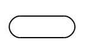
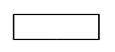
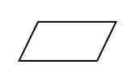
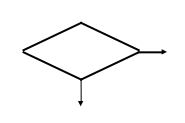
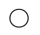
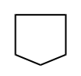
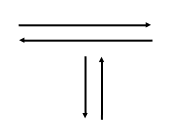

# Lenguajes Algorítmicos

En el capítulo [2](docs/entidades-primitivas.html) describimos qué es un
algoritmo, su clasificación y los lenguajes en los que podemos describirlos. Las
dos herramientas utilizadas comúnmente para diseñar algoritmos son: el diagrama
de flujo (lenguaje gráfico) y el pseudocódigo (lenguaje no gráfico), los cuales
describiremos en detalle en este Capítulo.

## Diagrama de Flujo

Un diagrama de flujo es la representación gráfica de un algoritmo. También se
puede decir que es la representación detallada en forma gráfica de como deben
realizarse los pasos en la computadora para producir resultados. Esta
representación gráfica se da cuando varios símbolos (que indican diferentes
procesos en la computadora), se relacionan entre sí mediante líneas que indican
el orden en que se deben ejecutar los procesos. Los símbolos utilizados han
sido normalizados por el Instituto Norteamericano de Normalización (ANSI,
*American National Standard Institute*).

| Símbolo | Descripción |
| ------- | ----------- |
| Símbolo terminal    | Indica el inicio y el final del diagrama de flujo. |
| Símbolo de asignación    | Indica la asignación de un valor en la memoria y/o la ejecución de una operación aritmética y/o lógica. |
| Símbolo de entrada    |. Indica la entrada de datos del teclado. |
| Símbolo de salida    | Indica la salida de información en la pantalla o monitor. |
| Símbolo de decisión    |. Indica la realización de una comparación de valores. |
| Conector dentro de página    | Representa la continuidad del diagrama dentro de la misma página. |
| Conector fuera de página    | Representa la continuidad del diagrama en otra página.
| Líneas de flujo o dirección    | Indican la secuencia en que se realizan las operaciones. |

Algunas recomendaciones para el diseño de diagramas de flujo son:

-   Se deben usar solamente líneas de flujo horizontales y/o verticales.
-   Se debe evitar el cruce de líneas utilizando los conectores.
-   Se deben usar conectores sólo cuando sea necesario.
-   No deben quedar líneas de flujo sin conectar.
-   Se deben trazar los símbolos de manera que se puedan leer de arriba
    hacia abajo y de izquierda a derecha.

## Pseudocódigo

El pseudocódigo es una mezcla de un lenguaje de programación y el español (o
cualquier otro idioma), que se emplea en programación estructurada para realizar
el diseño de un programa. El pseudocódigo se puede definir como un lenguaje de
especificación de algoritmos.

El pseudocódigo es la representación narrativa de los pasos que debe seguir un
algoritmo para dar solución a un problema determinado. El pseudocódigo utiliza 
palabras que indican el proceso a realizar.

Algunas de las ventajas de utilizar un pseudocódigo a un diagrama de flujo son:

-   Ocupa menos espacio en una hoja de papel
-   Permite representar en forma fácil operaciones repetitivas complejas
-   Es muy fácil pasar de pseudocódigo a un programa en algún lenguaje
    de programación.

La siguiente tabla resume las principales equivalencias entre los símbolos de los
diagramas de flujo y el pseudocódigo.

| Símbolo | Equivalencia |
| ------- | ------------ |
| Símbolo terminal | `inicio` o `fin` según sea el caso |
| Símbolo de entrada | `leer` |
| Símbolo de salida | `escribir` |
| Símbolo de decisión|`si` ... `entonces` .. `si no` |

## Ejercicios Propuestos

1.  ¿Qué es un diagrama de flujo?
2.  Mencione tres recomendaciones al esribir diagramas de flujo
3.  ¿Qué es el pseudocódigo?
4.  ¿Cuáles son las ventajas de usar pseudocódigo en lugar de un diagrama de
    flujo?
