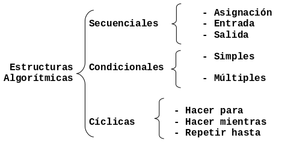

# Programación Estructurada

En este Capítulo se describen los diferentes paradigmas de programación que
existen, haciendo énfasis en las características de la **programación
estructurada**.

## Programación Estructurada

Las **estructuras de control** o estructuras algorítmicas permiten
**modificar la secuencia de ejecución** de las instrucciones de un
algoritmo o programa. Estas estructuras se clasifican de acuerdo con su
complejidad como se describe en la siguiente Figura:

El término programación estructurada se refiere, a un conjunto de técnicas que
han ido evolucionando desde los primeros trabajos del holandés Edsger Dijkstra.
En mayo de 1996, Corrado Böhm y Giuseppe Jacopini demostraron que un **programa
propio** puede escribirse utilizando sólamente tres tipos de estructuras de
control: secuenciales, condicionales y cíclicas. A esto se le llama
**teorema de la programación estructurada**.

Un programa se define como propio si cumple lo siguiente:

-   Posee un sólo punto de inicio y uno de fin.
-   Existe al menos un camino desde el inicio hasta el fin que se puede seguir
    y que pasa por todas las partes del programa.
-   Todas las instrucciones son ejecutables y no existen lazos o ciclos
    infinitos.

## Paradigmas de Programación

Dependiendo de las técnicas y del lenguaje de programación que se elija, se
puede hablar de **paradigmas de programación**. Los principales son:

-   **Programación Estructurada**. Esta programación utiliza un número limitado
    de estructuras de control, reduciendo así considerablemente los errores.
    Esta técnica incorpora:
    -   El uso de tres tipos de estructuras básicas:
        -   Estructuras secuenciales.
        -   Estructuras selectivas.
        -   Estructuras repetitivas.
    Un programa esta estructurado si posee un único punto de entrada y sólo uno
    de salida, existen de "1 a n" caminos desde el principio hasta el fin del
    programa.
-   **Programación modular**. La programación modular consta de varias secciones
    dividas de forma que interactúan a través de llamadas entre las secciones
    (procedimientos o funciones) que integran el programa en su totalidad. En la
    programación modular, el programa principal coordina las llamadas a los
    módulos secundarios y pasa los datos necesarios en forma de parámetros. A su
    vez cada módulo puede contener sus propios datos y llamar a otros módulos.
-   **Programación Orientada a Objetos**. El elemento principal de la
    programación orientada a objetos es el objeto. El objeto es un conjunto
    complejo de datos y programas que poseen estructura y un comportamiento
    definidos.
